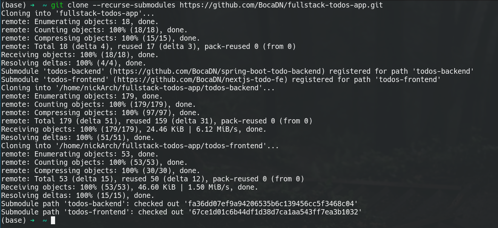
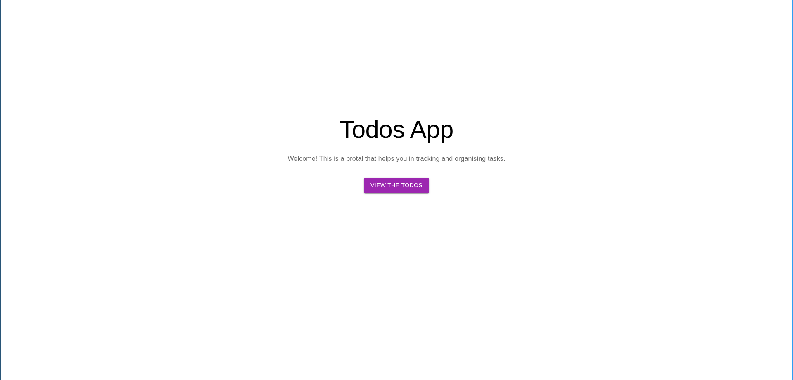
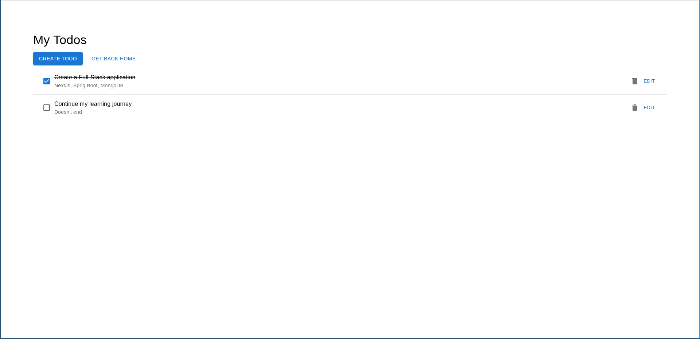
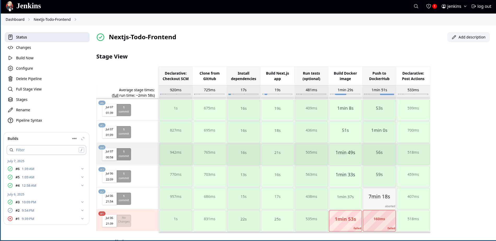
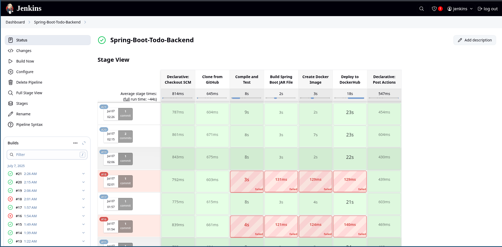

# Welcome to my project!

### To clone this repository successfully you need to ensure git submodules are pulled as well:

```bash
git clone --recurse-submodules https://github.com/BocaDN/fullstack-todos-app.git
```



### The simplest way to run this application locally is by using the docker-compose.yaml file:

#### Inside the cloned repository run the following:

```bash
docker-compose up
```

#### To access the application go to this link in your browser:

`http://localhost:3000` 

### This should be the landing page:



### The tasks menu:



### I used Jenkins for simplifying the build process. Here are some screenshots:



